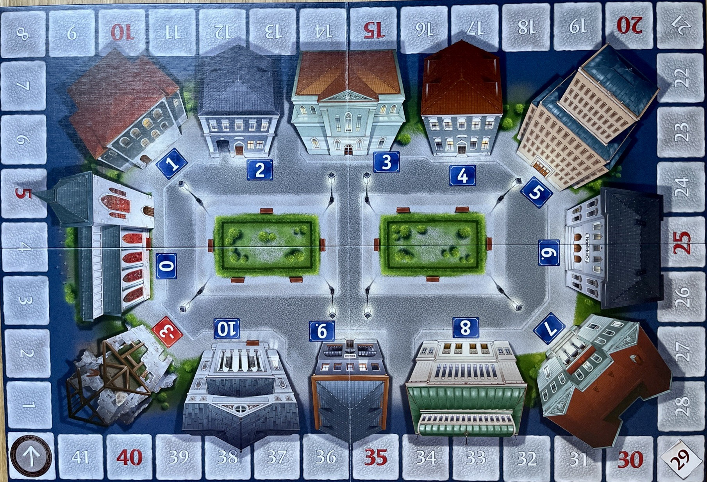

# Heimlich & Co
#### Game Instructions

## 1. Introduction and object of the game

Heimlich & Co is a strategy game for 2-7 players. Each player acts as a spy for their 
country. Their task is gathering as much information as possible.
Points act as accumulated information. The first player to gather 42 points wins the game.  
The knowledge about which player acts as which agent is supposed to remain a secret.
Therefore, players are not supposed to tell other players which agents they play. However, finding out which players
act as which agent might prove beneficial for players.

## 2. Elements of the Game

### 2.1 The Board

The board consists of 2 main parts. The buildings and the fields for the score markers.
There are 12 buildings (church, 10 normal buildings, ruin) as well as 42 fields for the score markers. 
The numbers in front of  the buildings act as points (information) that agents can gain (see below).  

### 2.2 The Die

The used dice is a standard die, except that there is no side which contains the number '1'. This side is replaced
with '1-3'. Its meaning of that will be explained later.

### 2.3 The Agents and the Safe
There can be up to 7 agents in the game, with each one having an agent figure and a score marker in the same color.  
Additionally, there is a safe, which will is placed in a building.

## 3. Setup
The number of agents in the game depends on the number of players: 

| # of players | # of agents |
|--------------|-------------|
| 2            | 5           |
| 3            | 6           |
| 4-7          | 7           |

As seen above, when there are less than 7 players, some agents are in the game that don't belong to a real player.
These are the so called 'dummy agents'. Note that these agents can also win. In that case, no 'real' player wins.  
Initially, all agents are placed in the church (building 0). The safe is placed in building 7. The buildings are numbered consecutively, starting with the church.
Each player is then secretly assigned an agent, which will be their agent until the end of the game.

## 4. Gameplay

In this game, players take turns. A turn for one player (in the basic game mode) looks as follows:  
1. The player rolls the die
2. The player moves at least one agent
3. If the player moves an agent into the building where the safe is located, scoring is triggered. This means that
the score markers for all agents are moved, and the current player moves the safe to a different building.

### 4.1 The player rolls the die
The player rolls the die, and the result determines how many move points the player gets. In case the player rolls '1-3', the player can decide between one, two or three move points.

### 4.2 The player moves at least one agent
The player can now move agents, how far is determined by the move points the player got in the previous step. Agents are moved clockwise.
It is important to note that a player can move any agent.  
The player can split up the move points between as many agents as they want. This means, if the player has 5 move points, he can 
move 5 agents by one field each, one agent by 2 fields and one agent by 3 fields, or one agent by 5 fields. Multiple agents can be in one building at the same time.
The player MUST 'spend' all of their move points.

### 4.3 Scoring and Safe Moving
If an agent is moved into the building with the safe (see 4.2), scoring is triggered, otherwise, this phase of the turn is skipped.  
If scoring is triggered, each player gets information (i.e. points) depending on which building they are currently in. The amount of points a player gets for a building/field is determined by the number below the building. This means,
that a player/agent can also lose points during the scoring round if they are in the ruins (-3 points). The score markers will be moved accordingly.  
After the points are added or subtracted, the current player must move the safe to a new building. They can choose any building except the one where the safe is currently placed.
Note that if the safe is moved into a building with an agent in it, scoring will not be triggered again. Scoring is only triggered when an agent is moved into the building with the safe.
  
If no scoring is not triggered, or after the safe is moved, the next player (clockwise) starts their turn by rolling the die.

### 5. End of the Game
The game ends when at least one agent reaches 42 or more points. When that happens, the player with the most points is the winner. If multiple agents/players have the highest amount of points, it is a draw between those players (in case a real player and a dummy player/agent draw, the engine counts the real player as the winner, as they are a winner and the other players are not).
A dummy agent can also be the solo winner, in that case it counts as a draw for all real players, no matter how many points they each have.

## 6. Top-Secret Mode
The top-secret mode is an extension to basic gameplay. In this mode, there are cards that can influence the outcome of the game.  
In total, there are 26 top-secret cards (25 are in the implemented game). At the beginning of the game, each player receives two cards, and can receive more during the game.  
The cards are described in separate 'Cards.pdf' file. A player can have 4 cards at most on hand.  
Therefore, there are a few changes:  
- **Die side '1-3'**: For this side, the player can now choose to receive 0 move points, and instead receive a card.
- **Receiving top-secret cards**: Players can only receive new cards when it is their turn. If a player already has 4 cards on hand, they will not receive a fifth one.
A player can receive a card in two cases:
  + The player moves one or more agents into the ruins with their move points
  + The player rolls '1-3' and chooses not to move an agent (chooses 0 move points).
- **Top-secret round**: The top-secret round takes place after the moving phase, i.e. after the player has moved agents according to their move points.

### 5.1 Top-Secret Round:
The top-secret round takes place after the current player has moved the agents and before possible scoring. It does not matter whether scoring was triggered by the player, the top-secret round always takes place.  
(The following is a small adaption the original game, but it is how it works in the engine, and essentially works the same as in the original game).  
The top-secret round works as follows:  
Each player (beginning with the player that is up after the current player) has the option to either play a card or to not play a card.
If the player chooses to play a card, the card is played and THE SAME player again has the chance to play a card or to not play a card.
This is repeated until the player chooses to not play a card. Then, the next player in line gets to play cards in the same way.
This is repeated until each player skipped playing a card without interruption. Meaning a full round of all players skipping playing a card has to be completed, then the game moves on to the next phase.
A few things to note here are:  
- If a player decides to not play a card, they can still play a card later in **the same** top-secret round. Meaning a player can always react to other players playing a card.
- If playing a card triggers a score, scoring is only done **after** the top-secret round. This also means that the scoring can be 'untriggered' by other cards (by moving the agent that triggered the scoring off the building with the safe, or by moving the safe).
- Playing a card can also 'untrigger' the scoring after the agents were moved by the current player. In general, when playing with cards, scoring is only done if an agent is moved onto the field with a safe and the agent and the safe remain there until the end of the top-secret round.
- Played cards are removed from the game.
- If there are no more top-secret cards left on the stack, players can not receive any more cards.

